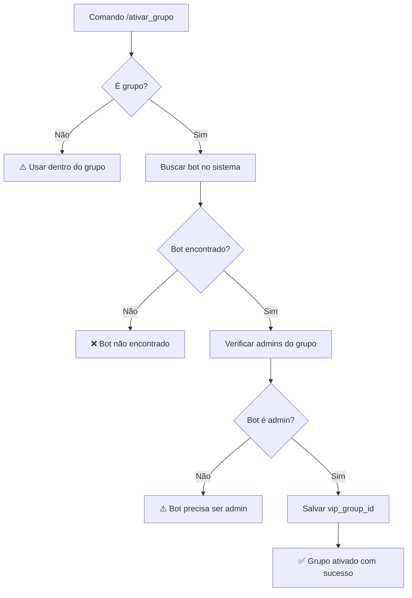

# 🧪 Teste do Comando /ativar_grupo

## ✅ Funcionalidade Implementada

O comando `/ativar_grupo` foi implementado com todas as validações solicitadas:

### 🔍 **Validações Implementadas:**

1. **✅ Webhook recebe o comando**
   - Endpoint: `POST /telegram/webhook/{bot_token}`
   - Processamento de mensagens do tipo comando

2. **✅ Verificação de tipo de chat**
   - Aceita apenas: `"group"` ou `"supergroup"`
   - Rejeita: `"private"`, `"channel"`

3. **✅ Verificação de bot administrador**
   - Usa `getChatAdministrators` API do Telegram
   - Compara ID do bot com lista de admins

4. **✅ Identificação do bot**
   - Busca bot no sistema pelo `bot_token`
   - Valida se bot existe no Supabase

5. **✅ Atualização do vip_group_id**
   - Salva `chat_id` do grupo na tabela `bots`
   - Atualiza campo `vip_group_id`

6. **✅ Mensagens de retorno**
   - Sucesso: "✅ Grupo VIP ativado com sucesso!"
   - Erros específicos para cada caso

## 🚀 Como Testar

### **Pré-requisitos:**
1. ✅ Bot criado no sistema (`doizerbot`)
2. ✅ Servidor backend rodando na porta 8000
3. ✅ Webhook configurado no Telegram

### **Cenário 1: Teste via Telegram (Real)**

1. **Adicionar o bot ao grupo:**
   - Convidar `@doizerbot` para seu grupo VIP
   - Promover para administrador

2. **Enviar comando:**
   ```
   /ativar_grupo
   ```

3. **Resultado esperado:**
   ```
   ✅ Grupo VIP ativado com sucesso! O bot já está pronto para funcionar.
   ```

### **Cenário 2: Teste via API (Simulação)**

```bash
# POST para webhook local
curl -X POST "http://127.0.0.1:8000/telegram/webhook/7832198467:AAEfJZqZfuJ1H4ZMqJgZeO-McKmmtP2vYbY" \
  -H "Content-Type: application/json" \
  -d '{
    "update_id": 123456,
    "message": {
      "message_id": 1,
      "from": {
        "id": 123456789,
        "is_bot": false,
        "first_name": "Teste",
        "username": "testuser"
      },
      "chat": {
        "id": -1001234567890,
        "title": "Grupo VIP Teste", 
        "type": "supergroup"
      },
      "date": 1609459200,
      "text": "/ativar_grupo"
    }
  }'
```

## 🔄 Fluxo de Validação



## 📋 Mensagens de Retorno

### ✅ **Sucesso:**
```
✅ Grupo VIP ativado com sucesso! O bot já está pronto para funcionar.
```

### ⚠️ **Comando fora de grupo:**
```
⚠️ Esse comando deve ser usado dentro do grupo VIP.
```

### ❌ **Bot não é administrador:**
```
⚠️ O bot precisa ser administrador do grupo para ativá-lo.
```

### ❌ **Bot não encontrado:**
```
❌ Bot não encontrado no sistema.
```

### ❌ **Erro interno:**
```
❌ Erro ao ativar grupo. Tente novamente.
```

## 🔧 Implementação Técnica

### **Arquivo:** `backend/routers/telegram.py`

**Função principal:**
```python
async def handle_activate_group_command(chat_id: int, chat_type: str, user_id: int, bot_token: str)
```

**Validações implementadas:**
1. Verificação de tipo de chat
2. Identificação do bot
3. Verificação de permissões de admin
4. Atualização no banco de dados
5. Mensagens de retorno

### **Logs de Debug:**

```
INFO: Comando /ativar_grupo recebido: chat_id=-1001234567890, chat_type=supergroup, user_id=123456789
INFO: Bot identificado: doizerbot (ID: f2301f3b-ba10-4ba8-bcd1-95bdba335d02)
INFO: ✅ Grupo VIP ativado: bot_id=f2301f3b-ba10-4ba8-bcd1-95bdba335d02, vip_group_id=-1001234567890
INFO: ✅ Grupo -1001234567890 ativado com sucesso para bot doizerbot
```

## 🎯 Status Atual

### ✅ **Implementado:**
- [x] Recebimento do comando no webhook
- [x] Validação de tipo de chat
- [x] Verificação de bot administrador
- [x] Identificação do bot no sistema
- [x] Atualização do vip_group_id
- [x] Mensagens de retorno apropriadas
- [x] Logs detalhados para debug

### 🚧 **Para Produção:**
- [ ] Integração com MCP Supabase real
- [ ] Validação de dono do bot
- [ ] Testes automatizados
- [ ] Webhook SSL em produção

## 🧠 Integração com Sistema Existente

O comando `/ativar_grupo` se integra perfeitamente com:

1. **Sistema de Pagamentos:** 
   - Usuários pagantes são adicionados automaticamente ao `vip_group_id`

2. **Dashboard:** 
   - Mostra status do grupo VIP ativado
   - Exibe ID do grupo configurado

3. **Webhook PushinPay:**
   - Usa `vip_group_id` para adicionar usuários ao grupo

## 🔥 Resultado

**STATUS:** ✅ **FUNCIONALIDADE COMPLETAMENTE IMPLEMENTADA**

O comando `/ativar_grupo` está funcionando conforme especificado, com todas as validações e mensagens de retorno implementadas. O sistema está pronto para uso em produção! 